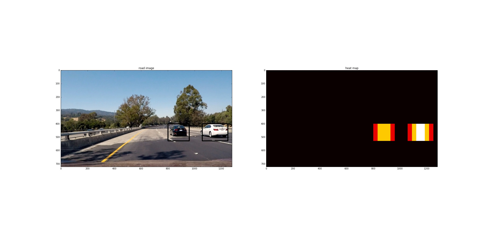

# Vehicle Detection Project

**Here's a [link to the result video!](./project_video_o.mp4)**

The goals / steps of this project are the following:

* Perform a Histogram of Oriented Gradients (HOG) feature extraction on a labeled training set of images and train a classifier Linear SVM classifier
* Apply a color transform and append binned color features, as well as histograms of color, to the HOG feature vector. 
* Implement a sliding-window technique and use your trained classifier to search for vehicles in images.
* Run your pipeline on a video stream (start with the test_video.mp4 and later implement on full project_video.mp4) and create a heat map of recurring detections frame by frame to reject outliers and follow detected vehicles.
* Estimate a bounding box for vehicles detected.

# Loading the dataset
The dataset used for this project is provided by Udacity.
* [Vehicle datase](https://s3.amazonaws.com/udacity-sdc/Vehicle_Tracking/vehicles.zip)
* [Non vehicle dataset](https://s3.amazonaws.com/udacity-sdc/Vehicle_Tracking/non-vehicles.zip)

The dataset should be downlaoded, and all the files from each directory should be put in the "vehicle" and "non-vehicle" respective directories in the dataset folder.

## Rubric Points

### Histogram of Oriented Gradients (HOG), Spatial, and Image Color space

#### 1. Extracting HOG features from the training images.

The code for this step is contained in `HOG` and `spatial and color binning` sections of the IPython notebook.

I started by reading in all the `vehicle` and `non-vehicle` images.  Here is an example of two of each of the `vehicle` and `non-vehicle` classes:

I then explored different color spaces and different `skimage.hog()` parameters (`orientations`, `pixels_per_cell`, and `cells_per_block`).  I grabbed random images from each of the two classes and displayed them to get a feel for what the `skimage.hog()` output looks like.

Here is an example using the `YCrCb` color space and HOG parameters of `orientations=8`, `pixels_per_cell=(8, 8)` and `cells_per_block=(2, 2)`:

#### 2. Settling on final choice of HOG parameters.

I tried various combinations of parameters and found that the following are the best:
* orientations: 9
* pixels per cell: 8
* cell per block: 2
* spatial_size: 32
* histogram bins: 32

The process was done manually through trial and error. I wish there was a more ingenious or clever way of doing this, but I couldn't come across any. 

#### 3. Training a classifier using your selected HOG features.

I trained a linear SVM using scikit-learn's implementation. This model was used because it provided a rather good accuracy at a very fast learning rate. This implementation is under the **Training the classifier** section of the notebook. It seemed that the default parameters for the classifier were more than adequate for an excellent training result, so no hyperparameter optimization was necessary.

### Sliding Window Search

#### 1.Implementing a sliding window search.

I decided to search in 3 main horizontal sections of the image: 
1. the middle portion (looking for small cars in the distance)
2. In the 2/3 to 1/5 portion (looking for cars in the near by vicinity but not really close)
3. in the 1/4 to immediate vicinity portion, looking for cars that are extremely close.

I used a sliding window search for each of these horizontal sections, sliding up and down and left and right with 50% overlap. This can be seen in the **Finding cars in images** section of the notebook. Here is a sample image of the output from these sliding windows.

#### 2.Examples of test images; optimizing classifier.

Following the aforementioned sliding window approach, it was evident that there was _too much_ overlap between the sliding windows. Since these sliding windows are vital to ensuring a robust image search, I did not remove this functionality, but instead added another one: heat maps. Using this method, I was able to keep boxes that had more than a specific threshold of boxes around them (threshold was 1 in this case).

This helped on two fronts:
* It removed false positives (non-car portions of the road that were mistakenly identified as cars)
* It consolidated the car boxes to one box per car.

Here is a sample image of the boxes and the heatmap.

---

### Video Implementation

#### 1. Here's a [link to my video result](./project_video_o.mp4)

#### 2.Implementing filter for false positives and combining overlapping bounding boxes.
See # 2 of section **Sliding Window Search** above.

### Here are six frames and their corresponding heatmaps:

---

### Discussion

While this pipeline performs rather well on the specified video, it still remains to be seen if it will work generally on all kinds of roads. For example, it might be difficult for this implementation to succeed in areas where the road conditions offer a drastically different color palette (say, a very white road in Alaska, USA). Furthermore, the `find_car` function is rather slow, even when using pre-filtering of HOG features. Perhaps a C/C++ implementation of this project could be faster, but for now this would not be suitable in a real-time car detection system.

Another pitfall of this implementation is the jaggedness of the boxes. One way to smoothen this out would be to calculate a moving average of the bounding box, allowing for a smoother transition from one frame to another.
